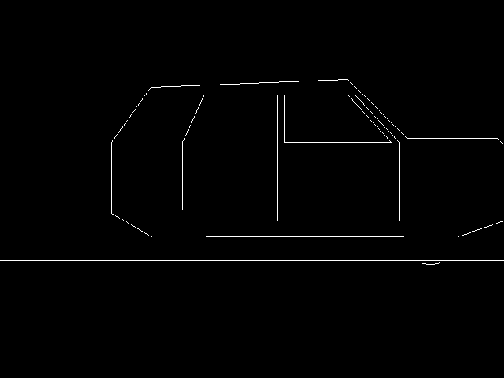
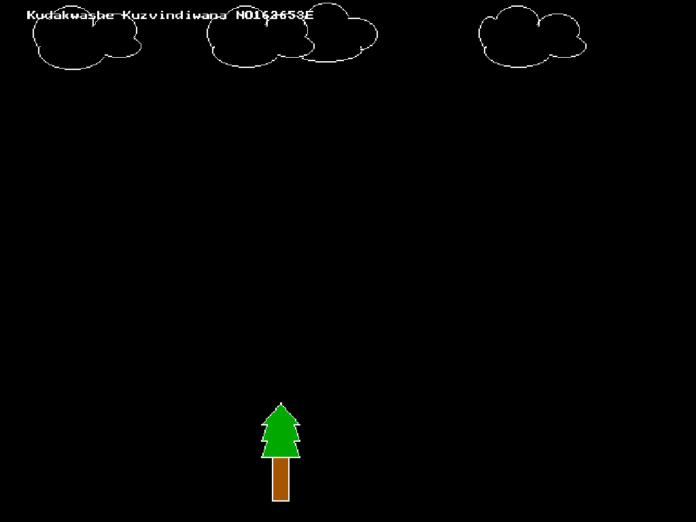
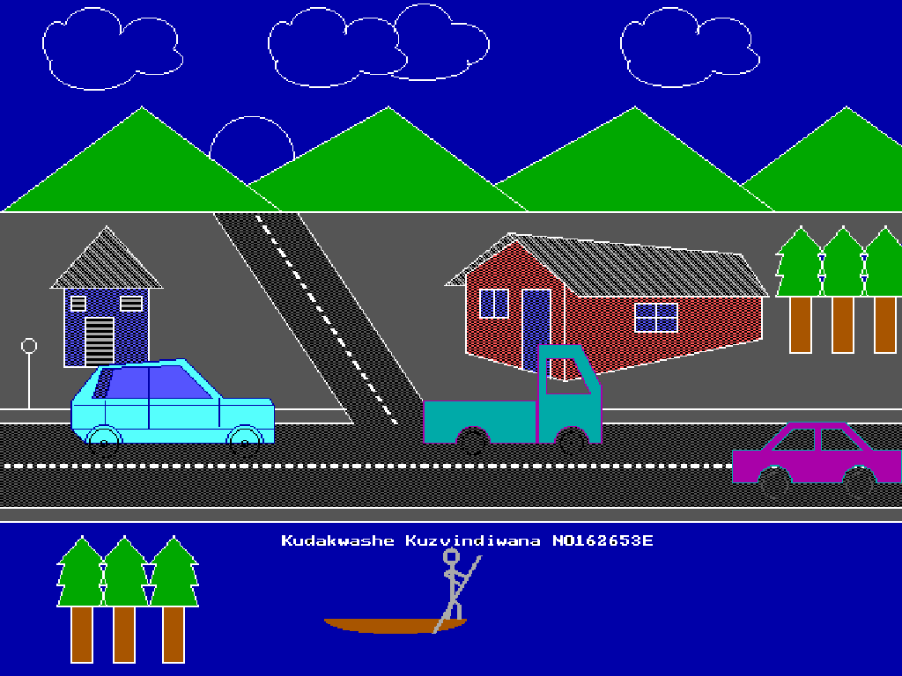

# Computer Graphics moving car

This script draws a moving car with  a background on your screen 

## Building and running the code

- This project will only work on a windows pc as it uses dos.h header file for colors
- Download and install turbo c++ if you dont have it and  the file car.c in turbo C++ compile and run enjoy the fruits of my labour
- if u have any other c compiler ensure that it is compatible with graphics.h ,dosh.h and conio.h
- do no forget to change """ initgraph(&gd,&gm,"c:\\tc\\bgi"); """ to point to your graphics.h location 

## Screenshots

 

## Credits

The code for a lorry and the hut is taken and refactored from (https://see-programming.blogspot.com/)

